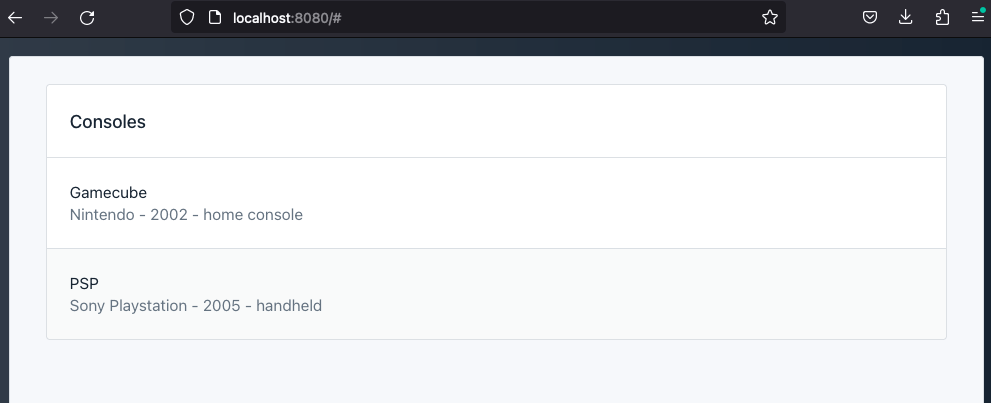

# sqlite-web-app
Using SQL to create a Web app

- https://formulae.brew.sh/formula/sqlite
- https://www.tutorialspoint.com/sqlite/sqlite_data_types.htm
- https://www.sqlite.org/datatype3.html
- https://sql.ophir.dev/documentation.sql?component=list#component
- https://github.com/lovasoa/SQLpage
- https://drawsql.app/teams/just-me-91/diagrams/schema

## Run

1. cd into root
2. run `sqlpage` to start local server

## Migrations

1. stop server
2. confirm changes
3. restart server